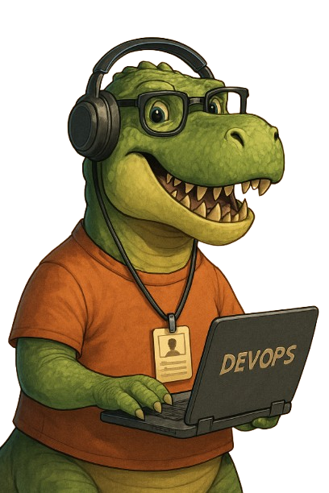

<h1 align="center">👋 Bonjour, moi c'est ODILON</h1>

<h3 align="center">Ou comme on le dit chez nous <em>"Manao ahoana!"</em></h3>

---

Je suis un <strong style="color:#FF6F00;">développeur passionné</strong> basé à <strong>Madagascar</strong>, avec un intérêt particulier pour la <strong>cybersécurité</strong>, le <strong>DevOps</strong> et la <strong style="color:#6A1B9A;">programmation</strong>.  
Je travaille constamment pour améliorer mes compétences et suis toujours curieux d'apprendre de nouvelles choses.

---

##  Compétences techniques

<table>
  <tr>
    <td>

- <strong>Langages de programmation</strong> :  
  <code>Java</code>, <code>JavaScript</code>, <code>Python</code>, <code>Go</code>, <code>Bash</code>

- <strong>Outils et technologies</strong> :  
  - <strong>Virtualisation</strong> : <code>VirtualBox</code>, <code>VMWare</code>, <code>Hyper-V</code>  
  - <strong>Versioning</strong> : <code>Git</code>, <code>GitLab</code>  
  - <strong>Monitoring</strong> : <code>Grafana</code>, <code>Prometheus</code>, <code>ELK</code>  
  - <strong>Sécurité</strong> : <code>SIEM Wazuh</code>, <code>IPS CrowdSec</code>, <code>Snort IDS/IPS</code>, <code>Iptables/UFW</code>, <code>Pfsense/FreeRADIUS</code>  
  - <strong>Conteneurisation</strong> : <code>Docker</code>, <code>Docker Compose</code>, <code>LXC/LXD</code>  
  - <strong>Clustering et orchestration</strong> : <code>Kubernetes</code>, <code>Docker Swarm</code>

- <strong>Environnement de développement</strong> :  
  <code>Linux</code>, <code>Windows</code>
   </td>
   <td>
     
   </td>
  </tr>
</table>
---

##  Projets récents

1. <strong style="color:#00ACC1;">Gestion d'hôtel en Java J2EE</strong> :  
   Développement d'une application de bureau sans framework pour la gestion d'un hôtel, en suivant l'architecture MVC.

2. <strong style="color:#00ACC1;">Maquette 3D en Three.js</strong> :  
   Intégration d'une maquette d'hôtel en 3D pour une visite virtuelle sur mon site.

---

##  Objectifs actuels

- Devenir <strong style="color:#00C853;">Ingénieur DevOps</strong>  
- Explorer le domaine de la <strong style="color:#D84315;">Red Team</strong>  
- Améliorer mes compétences en <strong style="color:#6A1B9A;">programmation</strong>

---

##  Contactez-moi

- 📎 <strong>LinkedIn</strong> : [Fitiavana Herimanantsoa](https://www.linkedin.com/in/fitiavana-herimanantsoa)  
- ✉️ <strong>Email</strong> : [herimanantsoa.odilon@gmail.com](mailto:herimanantsoa.odilon@gmail.com)  
- 🌐 <strong>Portfolio et blog</strong> : [Mon site](https://tonportfolio.com) *(en cours de développement)*

---

> Merci d'avoir visité mon profil. N'hésitez pas à explorer mes projets et à me contacter pour toute collaboration ou discussion technique. 🙌
